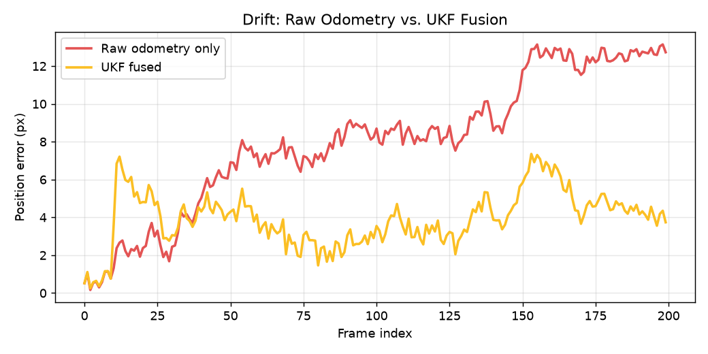

# VisLoc

**Vision-based GPS-denied localization, simulated end-to-end.**

Drones lose GPS — jammed, spoofed, or just unavailable. VisLoc demonstrates the
core idea behind GPS-denied visual navigation: match a downward-facing camera
against a known reference map for an absolute (but slow) position fix, track
frame-to-frame motion for a fast (but drifting) relative estimate, and fuse
the two with a Kalman/UKF filter to get a stable position with no GPS involved.

Fully simulated — no drone, no GPU, no paid satellite imagery required.

Inspired by [`ngps_flight`](https://github.com/snktshrma/ngps_flight) /
[`ap_nongps`](https://github.com/snktshrma/ap_nongps) (Sanket Sharma, ArduPilot
GSoC 2024 and follow-on work). This is an independent, simulation-only
reproduction for learning/portfolio purposes — not a fork of that codebase.

## Status: Phase 5 of 6

- [x] **Phase 1** — Synthetic world generator + frame simulator + ORB-based absolute localizer
- [x] **Phase 2** — Optical flow odometry + drift-only baseline
- [x] **Phase 3** — UKF fusion
- [x] **Phase 4** — Dashboard (live simulation view)
- [x] **Phase 5** — Parameter sandbox
- [ ] Phase 6 — Deploy + docs

See [`PRD.md`](PRD.md) for the full design doc.

## Live dashboard

**[aman-24052001.github.io/VisLoc](https://aman-24052001.github.io/VisLoc/)**

Includes a **parameter sandbox**: the UKF fusion engine ported to
JavaScript and run live, in the browser, on every slider change. Tune
process noise, VPS fix rate, soft-correction window, and the Mahalanobis
gate threshold/toggle, switch between three precomputed noise presets
(Calm/Standard/Turbulent), and watch the path overlay, error chart, and
headline drift-reduction stats recompute instantly. Re-running the actual
CV pipeline (ORB matching, optical flow) live in-browser isn't feasible
without porting OpenCV to JS, so camera/odometry data comes from
precomputed presets — but the fusion math itself, the part that's
actually interesting to tune, is genuinely live.

## Headline result

On the standard scenario (200-frame loop, ±2° yaw, σ=1.5px noise, VPS fix every 10 frames):

| Metric | Raw odometry | UKF fused | Reduction |
|---|---:|---:|---:|
| Final drift | 12.73px | 3.74px | **70.6%** |
| Mean error | 7.99px | 3.92px | **50.9%** |
| Max error | 13.14px | 7.36px | **44.0%** |



## What's working right now

- `visloc/world.py` — generates a deterministic, feature-rich synthetic
  aerial-style reference map (stands in for a real satellite tile; swap in
  a real aerial photo later with no code changes elsewhere)
- `visloc/simulator.py` — simulates a moving downward-facing camera along a
  configurable flight path (`loop`, `zigzag`, `straight`), with injectable
  position noise and yaw
- `visloc/localizer.py` — ORB/AKAZE feature matching + RANSAC homography to
  recover an absolute (x, y, yaw) fix for a single camera crop against the
  full reference map
- `visloc/odometry.py` — Lucas-Kanade optical flow based frame-to-frame
  motion estimator; integrates into a full path with no correction (the
  "raw odometry only" baseline)
- `visloc/fusion.py` — 4D constant-velocity UKF fusing every-frame VIO with
  sparse, gated, soft-corrected VPS fixes
- `visloc/evaluate_drift.py`, `visloc/evaluate_fusion.py` — generate the
  Phase 2/3 comparison charts

## When fusion helps (and when it doesn't) - tested honestly, not cherry-picked

Drift reduction is **scenario-dependent**, not universal. Tested across multiple
seeds and path shapes:

- **Loop paths with real drift to correct (most seeds): 49–61% reduction.** This is
  the regime the project targets - VIO accumulating real, compounding error.
- **Loop paths where VIO is already near the localizer's own ~4px noise floor
  (e.g. one seed showed 2.9px baseline error): ~0% reduction, occasionally
  slightly negative.** There's no headroom to improve once you're already at the
  measurement noise floor - the VPS fix carries its own ~4px error, so fusing it
  in can't reliably beat an already-accurate VIO estimate.
- **Straight-line paths: inconsistent, sometimes slightly negative.** A straight
  line is the one case where the constant-velocity model has zero mismatch to
  begin with, so VIO barely drifts and there's nothing substantial for fusion to
  fix.

This is consistent with the project's own engineering finding below
(process noise had to be tuned specifically to handle the *loop's
curvature*) - fusion's value is concentrated where there's a real,
compounding drift source (curvature, yaw) for it to correct.

## Engineering notes (real issues found while building this)

**ORB keypoint density (Phase 1).** Default OpenCV ORB thresholds (tuned for
full-size photographs) starved a 220×220px crop down to **5 keypoints**, and
the reference map needed roughly **20,000 features over a 2000×2000px area**
(not the default ~1,500) before matching stopped failing outright. Both are
documented inline in `localizer.py`.

**Ground-truth semantics (Phase 2).** Initially, `Frame.gt_x/gt_y` stored the
*idealized* flight-path waypoint rather than the actual noise-jittered
position the camera was really rendered at — harmless for Phase 1's
zero-mean-noise localizer test, but would have silently corrupted odometry
error measurement in Phase 2. Fixed before building odometry: ground truth
now reflects the true rendered camera pose.

**LK capture range.** Per-frame camera displacement needs to stay well
within Lucas-Kanade's tracking window relative to crop size — an early test
configuration moved ~100px/frame against a 200px crop and produced
wrong-sign, wrong-magnitude estimates. The same constraint resurfaced in
Phase 3: the original `zigzag` path moved ~65px/frame (5 full cycles
crammed into 200 frames) and was fixed by slowing its period to ~27px/frame.

**Realistic drift source.** Zero-yaw, noise-only frames barely drift
(~0.5px over 200 frames) because random per-step noise mostly cancels out.
Real drift comes from a small *systematic* bias translation-only LK can't
model — injecting a modest ±2° camera yaw (gimbal imperfection, exactly the
limitation noted in the original ArduPilot project) reproduces genuine,
compounding drift instead of an artificially manufactured one.

**UKF fusion — four real bugs found during tuning, in order:**
1. *Stale soft-correction waypoints.* The first soft-correction implementation
   precomputed fixed absolute waypoints at fix-time and applied them several
   frames later - by which point the true position had moved well past that
   point along the path, pulling the filter backward and causing oscillation
   instead of convergence. Fixed by re-deriving the target relative to the
   filter's *current* state each step.
2. *Overconfident bootstrap velocity.* Velocity at bootstrap is necessarily a
   guess (frame 0 has no prior frame), but giving it tight initial uncertainty
   made the filter under-trust the first genuine VIO velocity reading, causing
   it to crawl toward the true velocity over many frames while predicting
   forward with a near-zero velocity in the meantime. Fixed by giving bootstrap
   velocity deliberately *high* initial uncertainty.
3. *Filter crashes under aggressive tuning.* A Cholesky failure crashed the
   filter outright at higher `process_noise_std` values - P had lost
   positive-definiteness after many sequential ad-hoc updates. A flat epsilon
   jitter wasn't enough; fixed properly via eigenvalue clipping. This matters
   for Phase 5, where users will pick arbitrary slider values.
4. *Constant-velocity model vs. a curving path.* The original near-zero
   process noise assumed velocity barely changes between frames - fine for a
   straight line, but wrong for a loop (continuously turning), where it made
   the filter's velocity estimate structurally lag the true rotating velocity
   vector. Increasing `process_noise_std` to let the filter actually track the
   turn was the single biggest lever in the whole tuning process.

**A single bad VIO frame can permanently corrupt the path - known, open limitation.**
Traced a case (zigzag path, one specific seed) where one catastrophic LK
mistracking event - right at a sharp direction reversal, true Δy=-25px vs.
estimated Δy=+2px - got permanently baked into the cumulative odometry sum,
eventually growing the gap to VPS fixes large enough that the Mahalanobis
gate started rejecting the *correction* as anomalous too, locking the system
out of recovering. Two fixes were tried and **rejected**: substituting a
rolling-median delta on large deviation (backfired - a genuine sharp turn
deviates from recent history by a similar magnitude to a bad estimate, so
real turns got suppressed, sometimes permanently); median-filtering the whole
delta sequence (rejected - median filtering isn't bias-preserving, so it
introduced a small systematic bias on *every normal frame* that compounded via
the cumulative sum, which is worse than the rare event it targeted). Left
unfiltered rather than ship a fix that quietly breaks the common case. The
real `ngps_flight` project this is modeled on has the same open gap, listed in
its own TODO as "no fallback VO pipeline yet."

## Engineering notes — Phase 5 (porting the UKF to JavaScript)

**"UKF reduces to a linear KF for linear models" turned out to be false
for this specific library.** Before writing any JS, I verified
mathematically that since this project's process/measurement models are
both linear, the UKF should be exactly equivalent to a plain linear
Kalman filter — which would have let me port much simpler code. It
wasn't: a from-scratch linear KF gave a ~8.6px different final position
than the real `filterpy` UKF on identical inputs. Traced it to a specific
implementation detail: filterpy computes the state/measurement
cross-covariance (used for the Kalman gain) from sigma points generated
*before* process noise Q is added, while the predicted covariance itself
*includes* Q — an inconsistency inherent to the "additive noise" UKF
formulation, not a bug, but one that means UKF-with-additive-Q does not
mathematically collapse to a linear KF even when the model is linear.
Confirmed by reading filterpy's actual source rather than guessing, then
built a from-scratch Python reference implementation replicating that
exact behavior (including a second subtlety: calling `update()` twice in
one step, for the VIO observation and then the soft-correction, reuses
the *same* sigma points from the preceding `predict()` rather than
regenerating them — also intentional in filterpy, also replicated
deliberately) and validated it bit-for-bit against the real filter before
porting anything to JS.

**A scale/parameter mismatch silently distorted the Mahalanobis gate.**
After porting, three of three default-ish configs matched the Python
reference to sub-pixel precision — but one config (a stricter gate
threshold) was off by ~4px. The path/position data had been pre-scaled
for display, but the noise parameters (`vpsNoiseStd`, `processNoiseStd`,
etc.) hadn't been — so the innovation in the gate's Mahalanobis distance
was scaled while the covariance it's compared against wasn't, distorting
`d²` by exactly `scale²`. This barely affected the *position estimate*
(direct-position Kalman gains are close to 1 regardless), which is why it
took a deliberately-stricter config to even notice — but it flipped
accept/reject decisions at the gate boundary, which then cascaded. Fixed
by keeping the fusion math entirely in raw/unscaled coordinates (matching
Python exactly) and applying the display scale only at canvas render
time, never inside the filter.

**Numerical stabilization needed porting too, not just the filter math.**
The JS port includes a from-scratch cyclic Jacobi eigenvalue solver
specifically to replicate the eigenvalue-clipping stabilizer from Phase 3.
Without it, the same P-matrix instability that crashed the Python filter
under aggressive tuning would crash the in-browser sandbox the moment
someone dragged a slider too far.

## Try it

```bash
pip install -r requirements.txt
python -m visloc.world            # generates assets/world.png
python -m visloc.simulator        # generates sample camera-crop frames
python -m visloc.localizer        # runs the localizer against simulated frames
python -m visloc.odometry         # runs raw odometry tracking, prints drift stats
python -m visloc.evaluate_drift   # generates the Phase 2 baseline charts
python -m visloc.evaluate_fusion  # generates the Phase 3 fusion comparison charts
python -m visloc.export_dashboard_data  # generates docs/assets/* for the dashboard
python -m visloc.export_sandbox_data    # generates docs/assets/sandbox_data.json
pytest tests/ -v
```
