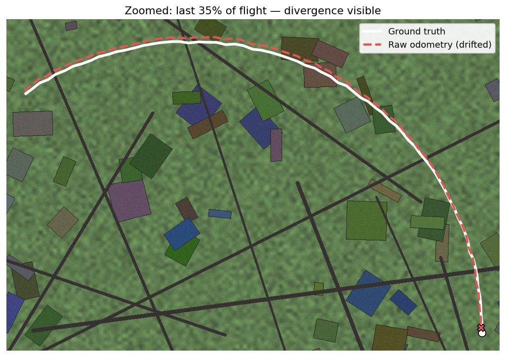
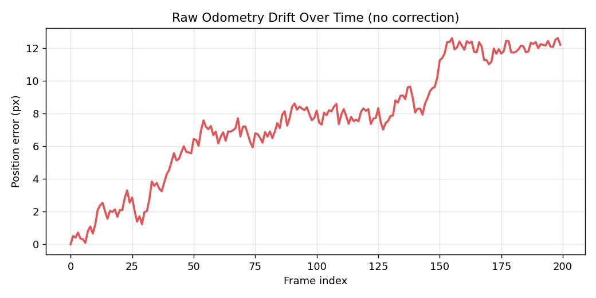

# VisLoc

**Vision-based GPS-denied localization, simulated end-to-end.**

Drones lose GPS — jammed, spoofed, or just unavailable. VisLoc demonstrates the
core idea behind GPS-denied visual navigation: match a downward-facing camera
against a known reference map for an absolute (but slow) position fix, track
frame-to-frame motion for a fast (but drifting) relative estimate, and fuse
the two with a Kalman/UKF filter to get a stable position with no GPS involved.

Fully simulated — no drone, no GPU, no paid satellite imagery required.

Inspired by [`ngps_flight`](https://github.com/snktshrma/ngps_flight) /
[`ap_nongps`](https://github.com/snktshrma/ap_nongps) (Sanket Sharma, ArduPilot
GSoC 2024 and follow-on work). This is an independent, simulation-only
reproduction for learning/portfolio purposes — not a fork of that codebase.

## Status: Phase 2 of 6

- [x] **Phase 1** — Synthetic world generator + frame simulator + ORB-based absolute localizer
- [x] **Phase 2** — Optical flow odometry + drift-only baseline
- [ ] Phase 3 — UKF fusion
- [ ] Phase 4 — Dashboard (live simulation view)
- [ ] Phase 5 — Parameter sandbox
- [ ] Phase 6 — Deploy + docs

See [`PRD.md`](PRD.md) for the full design doc.

## What's working right now

- `visloc/world.py` — generates a deterministic, feature-rich synthetic
  aerial-style reference map (stands in for a real satellite tile; swap in
  a real aerial photo later with no code changes elsewhere)
- `visloc/simulator.py` — simulates a moving downward-facing camera along a
  configurable flight path (`loop`, `zigzag`, `straight`), with injectable
  position noise and yaw
- `visloc/localizer.py` — ORB/AKAZE feature matching + RANSAC homography to
  recover an absolute (x, y, yaw) fix for a single camera crop against the
  full reference map
- `visloc/odometry.py` — Lucas-Kanade optical flow based frame-to-frame
  motion estimator; integrates into a full path with no correction (the
  "raw odometry only" baseline)
- `visloc/evaluate_drift.py` — generates the Phase 2 baseline charts

Tested under injected noise (σ=3px) and yaw (±8°): **0 failures, ~4px mean
error** across sampled frames at a simulated 1-in-10 absolute-fix rate
(localizer).

Raw odometry baseline (±2° yaw, σ=1.5px noise, 200-frame loop): drift grows
from 0px to **~12px** by the end of the flight, with no correction applied.
This is the gap Phase 3's UKF fusion needs to close.

| Path overlay (zoomed) | Drift over time |
|---|---|
|  |  |

## Try it

```bash
pip install -r requirements.txt
python -m visloc.world           # generates assets/world.png
python -m visloc.simulator       # generates sample camera-crop frames
python -m visloc.localizer       # runs the localizer against simulated frames
python -m visloc.odometry        # runs raw odometry tracking, prints drift stats
python -m visloc.evaluate_drift  # generates the Phase 2 baseline charts
pytest tests/ -v
```

## Engineering notes (real issues found while building this)

**ORB keypoint density (Phase 1).** Default OpenCV ORB thresholds (tuned for
full-size photographs) starved a 220×220px crop down to **5 keypoints**, and
the reference map needed roughly **20,000 features over a 2000×2000px area**
(not the default ~1,500) before matching stopped failing outright. Both are
documented inline in `localizer.py`.

**Ground-truth semantics (Phase 2).** Initially, `Frame.gt_x/gt_y` stored the
*idealized* flight-path waypoint rather than the actual noise-jittered
position the camera was really rendered at — harmless for Phase 1's
zero-mean-noise localizer test, but would have silently corrupted odometry
error measurement in Phase 2. Fixed before building odometry: ground truth
now reflects the true rendered camera pose.

**LK capture range.** Per-frame camera displacement needs to stay well
within Lucas-Kanade's tracking window relative to crop size — an early test
configuration moved ~100px/frame against a 200px crop and produced
wrong-sign, wrong-magnitude estimates. Fixed by matching simulated frame
rate to flight speed; documented in `odometry.py`.

**Realistic drift source.** Zero-yaw, noise-only frames barely drift
(~0.5px over 200 frames) because random per-step noise mostly cancels out.
Real drift comes from a small *systematic* bias translation-only LK can't
model — injecting a modest ±2° camera yaw (gimbal imperfection, exactly the
limitation noted in the original ArduPilot project) reproduces genuine,
compounding drift instead of an artificially manufactured one.
